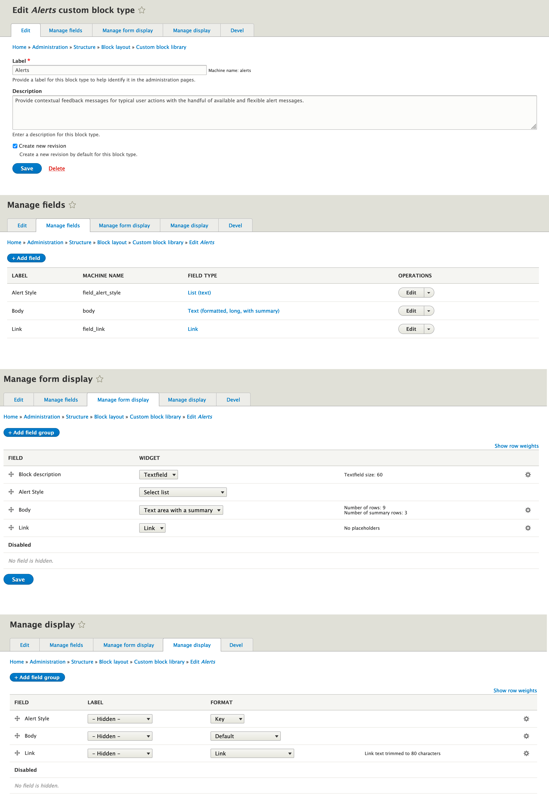

# *Add to the darwin.libraries.yml*

gt-alerts: 
version: "1.0.x" 
css: 
theme: 
templates/block/custom/alerts/css/gt-alerts.css: {} 
js: 
dependencies: 
- core/jquery 

# *Add to the repositories section in composer.json*

"repositories": [ 
{  
"type": "vcs",  
"url": "https://github.gatech.edu/ICWebTeam/block_alerts.git"  
}
# *Add to the require in composer.json*

"require": {  
"gt/alerts": "dev-master"  
},

# *Add to the installer paths in composer.json*
"installer-paths": {  
"web/themes/contrib/darwin/templates/block/custom/{$name}": [  
"gt/alerts"  
]  
},

# **DATABASE SET UP**

KEYS:
primary|primary
secondary|secondary
success|success
danger|danger
warning|warning
info|info
light|light
dark|dark
